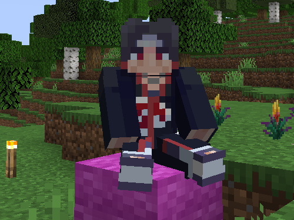
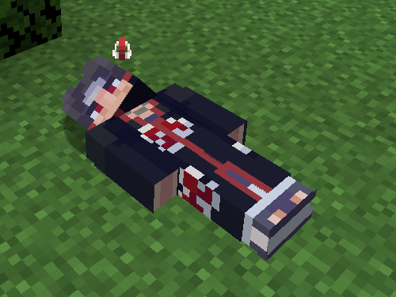
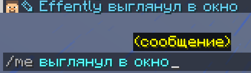
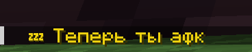
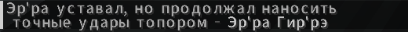

# Команды сервера

На сервере PIVOWorld доступны следующие команды.

## Технические команды

- `/praces lor` — Узнать информацию о своей расе
- `/pprof profession-get` — Информация о профессии
- `/pu` — Открывает меню прокачки игрока
- `/menu` — Открывает меню сервера

## Команды общения

- `/msg <ник>`, `/w <ник>`, `/tell <ник>` — Написать личное сообщение (ЛС) конкретному игроку  
  Вместо команды можно кликнуть по нику в чате.
- `/reply <сообщение>` — Ответить последнему игроку, которому вы писали ЛС
- `/ignore <ник>` — Добавить игрока в игнор / удалить из игнора
- `/ignorelist` — Показать список игроков в игноре
- `/tg` — Отключить/включить глобальный чат

## Команды RolePlay (РП)

- `/sit` — Сесть
  

- `/lay` — Лечь  
  

- `/crawl` — Ползти
  

- `/wroleplay:me <сообщение>` — Отыгровка действия от первого лица  
  

- `/hat` — Надеть выбранный блок на голову  
    *(здесь был hat, но ты загрузил hate (1).png — переименуй файл или исправь)*

- `/afk` — Войти в AFK-режим (появляется оповещение в чате и иконка в TAB)  
  

- `/todo <Фраза*Действие>` — Команда для большего погружения в происходящее  
  

- `/try <сообщение>` — Показывает, успешно или нет прошло ваше действие  
    
  

- `/do <сообщение>` — Отыгровка от третьего лица (с большой буквы и точкой в конце). Описывает последствия действия.  
  

- `/roll` — Бросить кубик d100 (D&D)

---

<Important>
  Все команды работают только на сервере PIVOWorld.
</Important>

  