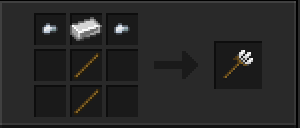
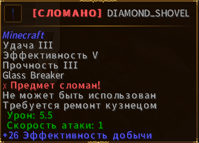

# Дополнительные механики

## Вилы (Механика покровов)

Думаю, многие знакомы с механикой вил в игре *Don't Starve Together*. Теперь она появилась и у нас.

### Как использовать:
- **Крафтите вилы**.
- **ЛКМ** по блоку травы, подзола или мицелия → вы получаете **1 покров**, а блок под ним становится обычной землёй.
- Чтобы постелить покров обратно: **ПКМ** покровом по обычной земле (блок должен быть пустым, без покрова и не каменистым) → получаете цельный блок травы, подзола или мицелия.

Механика небольшая, но интересная и полезная для терраформинга.

---

## Починка предметов

На сервере **отсутствует** зачарование «Починка» (Mending).

- Предметы чинятся **только на наковальне**.
- У игроков **без профессии Кузнец** есть **шанс сломать** предмет при починке на наковальне.

Пример сообщения при поломке предмета:

> **[СЛОМАНО]** DIAMOND_SHOVEL  
> Предмет сломан!  
> Не может быть использован.  
> Требуется ремонт кузнецом.

---

## Другие механики

- Возможность разводить аксолотлей с помощью предмета **«Тропическая рыба»**.
- Черепа и головы мобов быстрее ломаются с помощью **топора**.
- **Аметист** теперь выпадает, если сломать его киркой на **шелковое касание**.
- **Укреплённый глубинный сланец** выпадает, если сломать его киркой на **шелковое касание**.
- Выпадение **всех видов голов мобов**.
- Механика **вил** (как в Don’t Starve Together).

---

<Important>
  Многие механики завязаны на профессиях. Кузнец особенно полезен для безопасной починки дорогих предметов.
</Important>

<Additional>
  Механики могут обновляться с новыми сезонами.
</Additional>