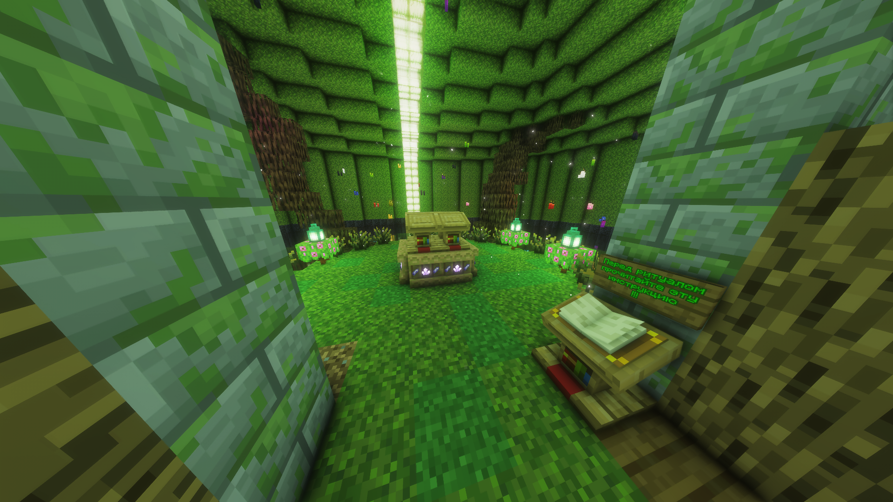

# Система магии

На сервере присутствует уникальная магическая система с маной и заклинаниями.

## Получение маны

В **Лесу Фей**, под **Великим Древом** по координатам **-1200 81 1300** находится **Священный алтарь маны**.

**Как получить ману:**
1. Кликните **ПКМ** по алтарю — запустится мини-игра.
2. В центре факел, по бокам зелёные стеклышки.
3. На факеле будет надпись, в какую сторону нажать (Вправо, Влево, Вверх, Вниз).
4. У вас **5 секунд** на правильный выбор.
5. После 10 успешных попаданий мини-игра завершится.
6. В чате появится **заклинание** — перепишите его в локальный чат с заглавной буквы, без точки. На это даётся **20 секунд**.

При успешном выполнении в верхней части экрана появится ваш **тип маны** и её запас.

---

## Заклинания и их использование

  

Чтобы использовать заклинания, вам нужен **Стол мага**.

1. Нажмите **ПКМ** по столу — откроется меню.
2. Положите **Пергамент** в одну ячейку.
3. Положите **Магические чернила** в другую.
4. Выберите нужный тип маны.
5. Получите **свиток заклинания** в правой ячейке.

---

## Повышение и восстановление маны

- **Повышение маны**: Потратив 75% запаса, есть **20% шанс** увеличить максимальный запас на 2% от текущего.
- **Восстановление**: Мана восстанавливается по **2%** каждые 3 минуты.

---

<Important>
  Магия требует точности и практики. Мини-игра на алтаре — ключ к получению маны.
</Important>

<Additional>
  Подробнее о конкретных заклинаниях можно узнать на Столе мага или у других игроков.
</Additional>