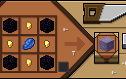
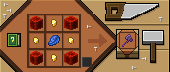
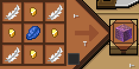
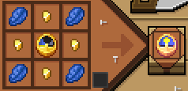
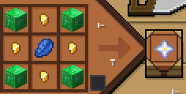

# Система прокачки навыков

Команда для открытия меню прокачки: `/pu`

## Основные характеристики

Каждая ветка прокачивается отдельно. Ниже приведены все пассивки по уровням.

### Живучесть

- **1 уровень**: +0.5 хп
- **2 уровень**: +0.2 реген
- **3 уровень**: +0.5 хп
- **4 уровень**: +0.2 реген
- **5 уровень** (1 из 3):
  - Железная кожа — -5% входящего урона
  - Быстрое восстановление — регенерация здоровья вне боя ускорена на 30%
  - Твёрдая опора — пока стоишь на земле +1 к защите
- **6 уровень**: +0.5 хп
- **7 уровень**: +0.2 реген
- **8 уровень**: +0.5 хп
- **9 уровень**: +0.2 реген
- **10 уровень** (1 из 3):
  - Второе дыхание — когда HP ниже 25%, Сопротивление I + Регенерация II на 15 сек (КД 5 мин)
  - Иммунитет к ядам — яд наносит на 30% меньше урона
  - Железная воля — слабость на тебя больше не работает
- **11 уровень**: +0.5 хп
- **12 уровень**: +0.2 реген
- **13 уровень**: +0.5 хп
- **14 уровень**: +0.2 реген
- **15 уровень** (1 из 3):
  - Тяжёлый панцирь — урон от снарядов снижается на 25%
  - Живой камень — стоя без движения 3 сек +20% брони
  - Внезапный вампиризм — когда HP ниже 50%, за удар +0.5 хп
- **16 уровень**: +1 хп
- **17 уровень**: +0.4 реген
- **18 уровень**: +1 хп
- **19 уровень**: +0.4 реген
- **20 уровень** (1 из 5):
  - **Скала** — Сопротивление III + Регенерация III + Замедление II (40 сек). КД 5 мин.
 **Скала** — Сопротивление III + Регенерация III + Замедление II (40 сек). КД 5 мин.

---

### Сила

- **1 уровень**: +0.2 урона
- **2 уровень**: +0.25 защиты
- **3 уровень**: +0.2 урона
- **4 уровень**: +0.25 защиты
- **5 уровень** (1 из 3):
  - Острые удары — +5% урона ближнего боя
  - Крушитель брони — игнорирование 5% брони
  - Кровотечение — 10% шанс наложить кровотечение на 5 секунд
- **6 уровень**: +0.2 урона
- **7 уровень**: +0.25 защиты
- **8 уровень**: +0.2 урона
- **9 уровень**: +0.25 защиты
- **10 уровень** (1 из 3):
  - Тяжелый удар — 15% шанс нанести +25% урона
  - Грубая сила — удары сильнее отбрасывают цель
  - Таран — удар после спринта +10% урона (КД 30 сек)
- **11 уровень**: +0.2 урона
- **12 уровень**: +0.25 защиты
- **13 уровень**: +0.2 урона
- **14 уровень**: +0.25 защиты
- **15 уровень** (1 из 3):
  - Разрушитель — 20% шанс вывести щит противника в кд
  - Прилив сил — когда HP ниже 10% +20% урона (КД 60 сек)
  - Двойной клинок — два меча дают +15% урона ближнего боя
- **16 уровень**: +0.4 урона
- **17 уровень**: +0.5 защиты
- **18 уровень**: +0.4 урона
- **19 уровень**: +0.5 защиты
- **20 уровень** (1 из 5):
  - **Ярость** — +40% урона, +15% скорости атаки, +20% получаемого урона на 10 секунд. КД 5 мин.
 **Ярость** — +40% урона, +15% скорости атаки, +20% получаемого урона (10 сек). КД 5 мин.

---

### Ловкость

- **1 уровень**: +0.04 к скорости атаки
- **2 уровень**: +0.2 к скорости
- **3 уровень**: +0.04 к скорости атаки
- **4 уровень**: -0.05 к отбрасыванию
- **5 уровень** (1 из 3):
  - Легкие ноги — -20% урона от падений
  - Уклонение — 5% шанс уклониться от атаки
  - Тихий шаг — шаги не активируют датчики, мобы слышат хуже
- **6–9 уровень**: +0.04 к скорости атаки / +0.2 к скорости / -0.05 к отбрасыванию
- **10 уровень** (1 из 3):
  - Контрудар — после уклонения следующий удар +15% урона
  - Реакция — при получении удара 20% шанс получить Скорость II на 3 сек
  - Анти-крит — -20% урона от крита
- **11–14 уровень**: +0.04 к скорости атаки / +0.2 к скорости / -0.05 к отбрасыванию
- **15 уровень** (1 из 3):
  - Легкая броня — скорость +10% при любой броне (кроме незерита)
  - Скоростной боец — удары быстрее
  - Паркурщик — высота прыжка +1 блок
- **16–19 уровень**: +0.08 к скорости атаки / +0.4 к скорости / -0.05 к отбрасыванию
- **20 уровень** (1 из 5):
  - **Дэш** — мгновенное перемещение на 4 блока вперёд. КД 30 сек.
 **Дэш** — Перемещение на 4 блока вперёд. КД 30 сек.

---

### Интеллект

- **1 уровень**: +2% получаемого опыта
- **2 уровень**: +0.2 блока взаимодействия
- **3 уровень**: +0.5% получаемого xp
- **4 уровень**: +0.2 блока взаимодействия
- **5 уровень** (1 из 3):
  - Эффективность зелий — +10% длительности положительных зелий
  - Эрудит — получаемый опыт +10%
  - Память мертвеца — после смерти сохраняется на 25% больше опыта
- **6–9 уровень**: +2% опыта / +0.2 блока
- **10 уровень** (1 из 3):
  - Контроль — негативные эффекты длятся на 10% дольше
  - Дизинчантер — снятие чар даёт +25% опыта
  - Магическая устойчивость — -15% урона от зелий и эффектов
- **11–14 уровень**: +2% опыта / +0.2 блока
- **15 уровень** (1 из 3):
  - Арканный поток — после зелья силы +10% урона на 5 сек (КД 1 мин)
  - Умелое обращение — 25% шанс не потратить прочность
  - Ментальная дисциплина — дебаффы действуют на 20% меньше
- **16–19 уровень**: +4% опыта / +0.4 блока
- **20 уровень** (1 из 5):
  - **Слоумо** — Замедление IV + Слабость II в радиусе 2 блоков (20 сек). КД 5 мин.
 **Слоумо** — Замедление IV + Слабость II в радиусе 2 блоков (20 сек). КД 5 мин.
---

### Удача

- **1 уровень**: +0.2 удачи
- **2 уровень**: +0.25% крит
- **3 уровень**: +0.2 удачи
- **4 уровень**: +0.25% крит
- **5 уровень** (1 из 3):
  - Везунчик урона — шанс крита 10%
  - Король шахт — +15% шанс дополнительного дропа с руд
  - Везунчик лута — 10% шанс увеличить лут с моба вдвое
- **6–9 уровень**: +0.2 удачи / +0.25% крит
- **10 уровень** (1 из 3):
  - Путь фортуны — +10% шанс на редкий лут из сундуков
  - Последний шанс — 5% шанс остаться с 1 хп + Сопротивление III на 5 сек
  - Золотая жила — 10% шанс удвоить опыт с руд
- **11–14 уровень**: +0.2 удачи / +0.25% крит
- **15 уровень** (1 из 3):
  - Счастливчик — каждый крит восстанавливает 1 хп
  - Удачливый рыбак — 20% шанс не потратить наживку
  - Фартовый боец — 25% шанс, что крит нанесёт на 20% больше урона
- **16–19 уровень**: +0.4 удачи / +0.5% крит
- **20 уровень** (1 из 5):
  - **Фортуна** — случайный положительный эффект II уровня на себя и тиммейтов (1 минута). КД 5 мин.
 **Фортуна** — Случайный положительный эффект II уровня на себя и тиммейтов (1 минута). КД 5 мин.
---
<Important>
  На 5, 10, 15 уровнях каждой ветки вы выбираете 1 навык из 3
</Important>

<Important>
  Активные способности имеют длительную перезарядку вы можете выбрать 1 активную способность и 5 веток. Выбор ветки определяет ваш стиль игры.
</Important>

<Additional>
  Полное меню прокачки доступно по команде `/pu`.
</Additional>