# Профессии и инструменты

На сервере каждая профессия имеет свою уникальную станцию и набор инструментов.

## Алхимик
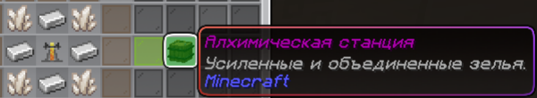  
**Алхимическая станция** — Создание усиленных и объединённых зелий.

## Травник
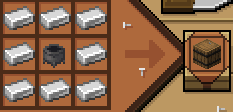  
**Котёл травника** — Порошки, настои и мази.

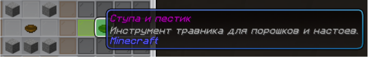  
**Ступа и пестик** — Основной инструмент травника.

## Лекарь
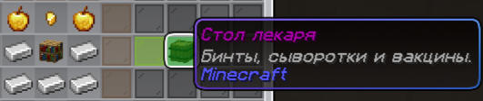  
**Стол лекаря** — Бинты, сыворотки и вакцины.

## Охотник
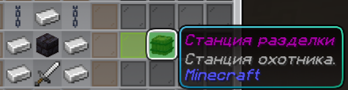  
**Станция разделки** — Обработка добычи.

## Некромант
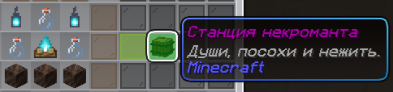  
**Станция некроманта** — Души, посохи и призыв нежити.

## Кузнец
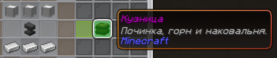  
**Кузница** — Починка и создание инструментов.

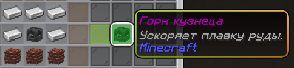  
**Горн кузнеца** — Ускоряет плавку.

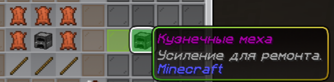  
**Кузнечные меха** — Усиление ремонта.

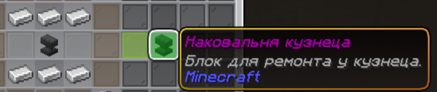  
**Наковальня кузнеца** — Ремонт предметов.

## Плотник
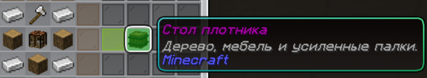  
**Стол плотника** — Дерево, мебель, усиленные палки.

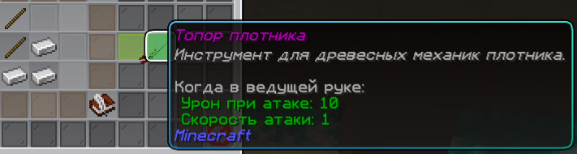  
**Топор плотника** — Работа с древесными механизмами.

## Фермер / Трактирщик
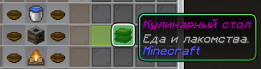  
**Кулинарный стол** — Приготовление еды.

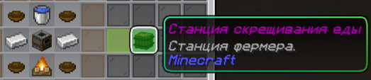  
**Станция скрещивания еды** — Улучшение семян и еды.

## Шпион
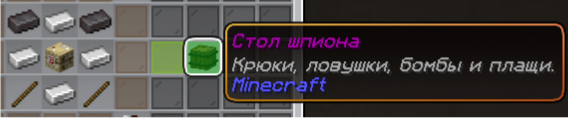  
**Стол шпиона** — Крюки, бомбы, плащи и ловушки.

## Ювелир
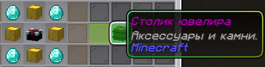  
**Столик ювелира** — Аксессуары и обработка камней.

## Общие инструменты

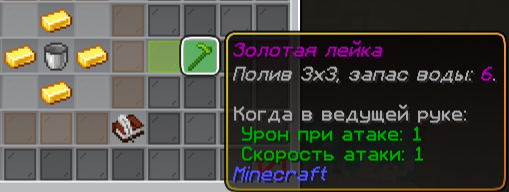  
**Золотая лейка** — Полив 3×3.

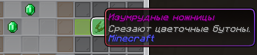  
**Изумрудные ножницы** — Срезание цветочных бутонов.

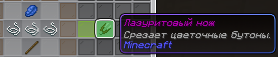 / 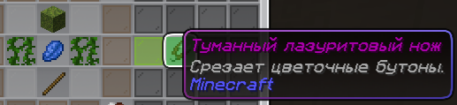  
**Лазуритовые ножи** — Срезание цветочных бутонов.

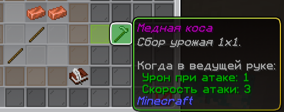  
**Медная коса** — Быстрый сбор урожая 1×1.

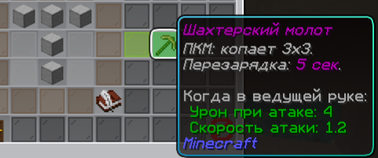  
**Шахтерский молот** — Копает 3×3.

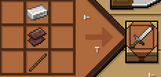  
**Кинжал убийцы** — Бонус за удар в спину.

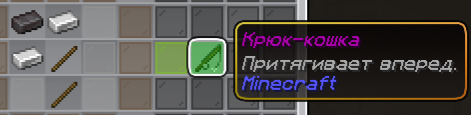  
**Крюк-кошка** — Притягивание вперёд.

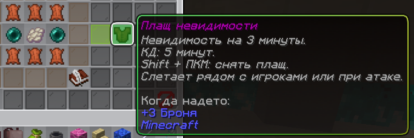  
**Плащ невидимости** — Невидимость на 3 минуты.

---

<Important>
  Инструменты и станции сильно зависят от выбранной профессии.
</Important>
