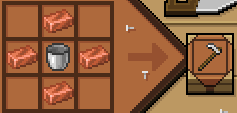
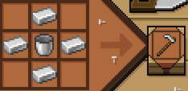
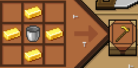
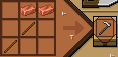
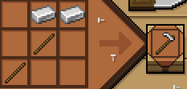
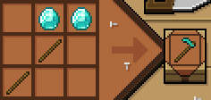
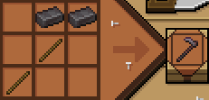
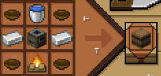

# Профессии

На сервере каждая профессия даёт уникальные преимущества, крафты и механики. Выбор профессии сильно влияет на стиль игры.

## Фермер

**Баффы:**
- Может есть сырую еду, продукты при сборе не бывают гнилыми.
- +10% к сбору многодропного урожая.
- На шифте ускоряет рост соседних посевов на 15%.

**Предметы:**
**Лейки** (эффект костной муки за 1 воду):

  
**Медная лейка** — полив 1 блок / 8 воды

  
**Железная лейка** — полив 2×2 / 16 воды

  
**Золотая лейка** — полив 3×3 / 6 воды

**Косы** (автосбор урожая в инвентарь на ПКМ):

  
**Медная коса** — 1×1

  
**Железная коса** — 2×2

  
**Алмазная коса** — 3×3

  
**Незеритовая коса** — 4×4

**Связи:**  
Трактирщик

**Дебаффы, если не эта профессия:**  
При сборе урожая высокий шанс получить гниль или только одну семечку.

**Строения:**  
Станция скрещивания еды

---

## Охотник

**Баффы:**
- Питается сырой и вызывающей голод едой без негативных эффектов.
- Повышенный шанс выпадения туши животного и возможность их разделки.
- Прирученные собаки получают +50% HP, +60% урона и +40% скорости.
- В присяде неподвижно в лесных биомах скрыт от мобов (видят только с 2 блоков).
- Лошади под охотником получают +25% скорости и +15% к высоте прыжка.

**Крафты:**
- **Лук охотника** — +2 к урону, +15% к добыче и +15% к опыту.

**Связи:**  
Трактирщик

**Дебаффы, если не эта профессия:**  
Нельзя есть сырую еду (даёт голод и тошноту), использовать Лук охотника и разделывать туши.

**Строения:**  
Станция разделки

---

## Лекарь

**Баффы:**
- Пассивный бонус +50% к иммунитету против болезней.
- Бинтует себя и союзников, восстанавливая 15% HP (перезарядка 5 секунд).
- **Посох жизни** (кд 5 мин): тратит 8 своих сердец, даёт всем в радиусе 5 блоков Регенерацию III и Сопротивление I на 30 секунд.

**Крафты:**
- **Бинт** (для всех) — восстанавливает 1 сердце + Регенерация на 10 секунд.
- **Сыворотка** (только лекарь) — даёт адаптивность к болезням и Сопротивление I на 2 минуты.
- Вакцины от болезней на станции.

**Связи:**  
Травник и Алхимик

**Дебаффы, если не эта профессия:**  
Другие игроки не могут самостоятельно излечиваться от болезней.

**Строения:**  
Стол лекаря

---

## Алхимик

**Баффы:**
- Зелья варятся без негативных эффектов и не теряют свойства.
- Время действия и сила дебаффов на себя уменьшены на 30%.
- Молоко снимает только 1 случайный дебаф (бафы не трогает).
- Увеличивает уровень зелий на +1 (максимум до III) и делает ×2 к длительности.
- Шанс 20% сохранить редстоун/светопыль при улучшении зелья.

**Крафты:**
- **Посох жизни**
- **Зелье насыщения** — даёт сытость из густого зелья, золотой моркови и золотого яблока.

**Связи:**  
Травник

**Дебаффы, если не эта профессия:**  
При варке всегда получается мутное зелье или обычная вода.

**Строения:**  
Алхимическая станция

---

## Шпион

**Баффы:**
- После использования дымовой бомбы получает +10% к скорости и Невидимость на 5 секунд.

**Крафты:**
- **Крюк-кошка**
- **Дымовая бомба**
- **Плащ-невидимка** — 3 минуты скрытности +15% скорости на шифте
- **Кинжал Убийцы** — высокая скорость, +10% урона в спину

**Связи:**  
Нет

**Дебаффы, если не эта профессия:**  
Полный запрет на использование шпионских предметов, ловушек и оружия.

**Строения:**  
Стол шпиона

---

## Плотник

**Баффы:**
- Бревна никогда не раскалываются при добыче.
- Разрушает деревянные предметы на 50% быстрее (только с топором).
- Шанс выпадения саженцев увеличен в 2 раза.
- Пассивный шанс 30% скрафтить из одного бревна 5 или 6 досок.

**Крафты:**
- **Топор Плотника** — свойства незеритового, функция Дровосека и обтесывание коры 3×3.

**Связи:**  
Нет

**Дебаффы, если не эта профессия:**  
При рубке есть шанс расколоть и испортить дерево.

**Строения:**  
Стод плотника

---

## Некромант

**Баффы:**
- Призванная нежить следует за хозяином и атакует его цели.

**Крафты:**
- **Посохи некроманта:**
  - Белый череп — воскрешает погибшего игрока
  - Синий череп — слабая нежить
  - Красный посох — нежить-воин (железная броня)
  - Чёрный посох — нежить-полководец (алмазная броня)

**Связи:**  
Ювелир (красный и чёрный посохи)

**Дебаффы, если не эта профессия:**  
Запрещено воскрешать союзников и призывать нежить.

**Строения:**  
Станция некроманта

---

## Кузнец

**Баффы:**
- Единственный, кто чинит предметы и снимает тег «СЛОМАНО».
- Шанс 25% спасти ломающийся предмет.

**Крафты:**
- **Кузнечный горн** — плавит руду быстрее, шанс удвоить слитки.
- **Кузнечные меха** — улучшение наковальни.
- **Наковальня Кузнеца** — чинит предметы за опыт или ресурсы.

**Связи:**  
Чародей

**Дебаффы, если не эта профессия:**  
Не может чинить вещи. Обычные предметы имеют шанс безвозвратно сломаться.

**Строения:**  
Кузница, Наковальня кузнеца, Горн кузнеца, Кузнечные меха

---

## Ювелир

**Баффы:**
- Уникальный стол с меню крафта и объединения предметов.
- При крафте выдаёт случайный баф (25% шанс).
- За 2 алмазных блока настраивает стол на конкретный баф (шанс 50%).

**Крафты:**
- Аксессуары (Кольцо, Амулет и др.)
- Легендарные артефакты (объединение с камнями Каменщика)

**Связи:**  
Каменщик и Некромант

**Дебаффы, если не эта профессия:**  
Не может создавать аксессуары и артефакты.

**Строения:**  
Столик ювелира

---

## Трактирщик

**Баффы:**
- Иммунитет к негативным эффектам от испорченной еды.
- Шанс 30% получить хлеб вместо пустой миски при поедании супов.
- Еда даёт Сытость на 1 минуту при полном голоде.

**Крафты:**
- Свитки Brewery — алкогольные рецепты.
- Создание станций для кулинарии.

**Связи:**  
Фермер и Охотник

**Дебаффы, если не эта профессия:**  
Полный запрет на создание кастомной и сложной еды.

**Строения:**  
Кулинарный стол (даёт баф «Домашний очаг»)

---

## Каменщик

**Баффы:**
- Повышенная скорость копания руд и встроенная удача.

**Крафты:**
- **Камнерезная станция** — добыча и огранка самоцветов.
- **Шахтерский Молот** — копает 3×3×1 раз в 5 секунд.

**Связи:**  
Ювелир

**Дебаффы, если не эта профессия:**  
Не может находить и выкапывать самоцветы.

**Строения:**  
Улучшеный камнерез

---

## Травник

**Баффы:**
- Способен собирать все виды цветов.

**Крафты:**
- Специальные ножи для срезания бутонов.
- Ступка с пестиком — перетирает бутоны в порошки.
- Производственный котел — варка настоев.

**Связи:**  
Лекарь и Алхимик

**Дебаффы, если не эта профессия:**  
При сборе цветов бутоны не выпадают. Запрещено использовать ножи и станции.

**Строения:**  
Котел травника

---

## Чародей

**Баффы:**
- Единственный, кто накладывает чары.
- +20% опыта при убийстве мобов зачарованным оружием.

**Крафты:**
- Бутылочки опыта.
- Снятие и экстракция чар.

**Связи:**  
Кузнец и Каменщик

**Дебаффы, если не эта профессия:**  
Не может накладывать и снимать чары.

**Строения:**  
Чародейский стол

---

<Additional>
  Выбор профессии — важное решение, влияющее на весь игровой процесс.
</Additional>
